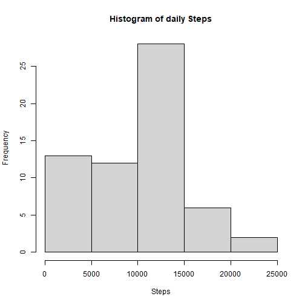
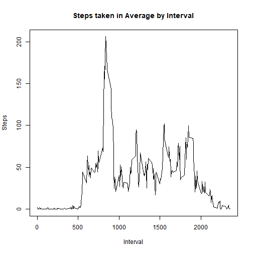
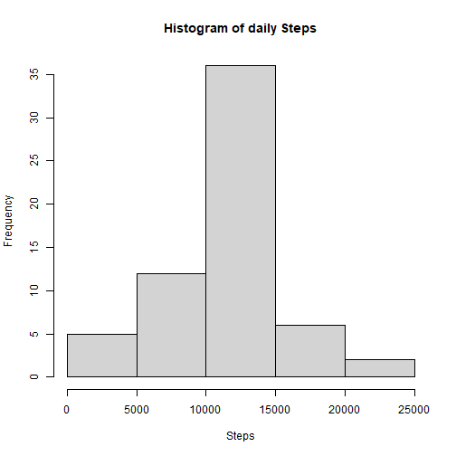
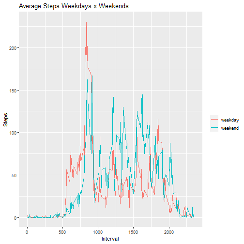

## Getting data

```r
data <- read.csv("activity.csv")
```


Peek through

```r
str(data)
```

```
## 'data.frame':	17568 obs. of  3 variables:
##  $ steps   : int  NA NA NA NA NA NA NA NA NA NA ...
##  $ date    : chr  "2012-10-01" "2012-10-01" "2012-10-01" "2012-10-01" ...
##  $ interval: int  0 5 10 15 20 25 30 35 40 45 ...
```
## Transform
Aggregating steps by day and tidying dataframe

```r
daily <- aggregate(data$steps, by=list(data$date), FUN=sum, na.rm=T)
colnames(daily) <- c("Day", "Steps")
daily$Day <- as.Date(daily$Day)
```
## Processing and plotting

**1. Histogram of the total number of steps taken each day**

```r
hist(daily$Steps, main = "Histogram of daily Steps", xlab = "Steps")
```



**2. Mean and median number of steps taken each day**

```r
avg <- mean(daily$Steps, na.rm = T)
med <- median(daily$Steps, na.rm = T)
```
In average (mean) 9354 steps has taken. The median of steps taken per day is 10395. 

**3. Time series plot of the average number of steps taken**

```r
intsteps <- aggregate(data$steps, by=list(data$interval), FUN=mean, na.rm=T)
colnames(intsteps) <- c("Interval", "Steps")
plot(y=intsteps$Steps,
     x=intsteps$Interval,
     type="l", 
     main = "Steps taken in Average by Interval", 
     xlab = "Interval", 
     ylab = "Steps")
```



**4. The 5-minute interval that, on average, contains the maximum number of steps**

```r
intsteps[which.max(intsteps$Steps),1]
```

```
## [1] 835
```
**5. Code to describe and show a strategy for imputing missing data**

Missing data in the source (Na) switched by mean of interval


```r
missing <- data[is.na(data$steps),]
colnames(missing) <- c("Steps","Date","Interval")
tbl <- merge(missing,intsteps, by="Interval")
fillmissing <- select(tbl,c(steps = Steps.y, date = Date, interval = Interval))
complete <- rbind(subset(data,!is.na(data$steps)),fillmissing)
```

**6. Histogram of the total number of steps taken each day after missing values are imputed**

```r
dailycomp <- aggregate(complete$steps, by=list(complete$date), FUN=sum, na.rm=T)
colnames(dailycomp) <- c("Day", "Steps")
dailycomp$Day <- as.Date(dailycomp$Day)
hist(dailycomp$Steps, main = "Histogram of daily Steps", xlab = "Steps")
```


**7. Panel plot comparing the average number of steps taken per 5-minute interval across weekdays and weekends**

```r
complete$wd <- ifelse(weekdays(as.Date(complete$date))=="Saturday"|weekdays(as.Date(complete$date))=="Sunday",yes = "weekend", no = "weekday")
head(complete)
```

```
##     steps       date interval      wd
## 289     0 2012-10-02        0 weekday
## 290     0 2012-10-02        5 weekday
## 291     0 2012-10-02       10 weekday
## 292     0 2012-10-02       15 weekday
## 293     0 2012-10-02       20 weekday
## 294     0 2012-10-02       25 weekday
```

```r
compweekday <- complete %>% group_by(wd,interval) %>% summarise(steps = mean(steps))
p <- ggplot(data = compweekday, 
                   aes(x = compweekday$interval, 
                       y = compweekday$steps, 
                       col = compweekday$wd) ) + geom_line()
p + labs(title = "Average Steps Weekdays x Weekends", x = "Interval", y = "Steps",colour = "")
```




